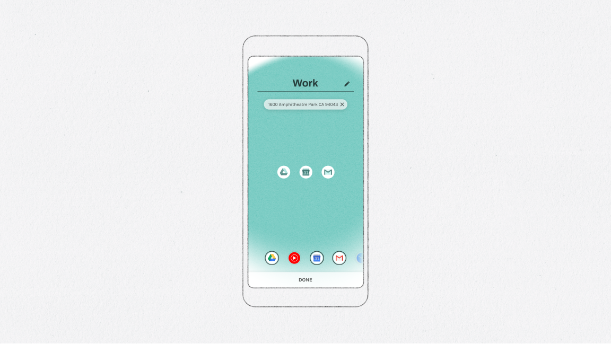
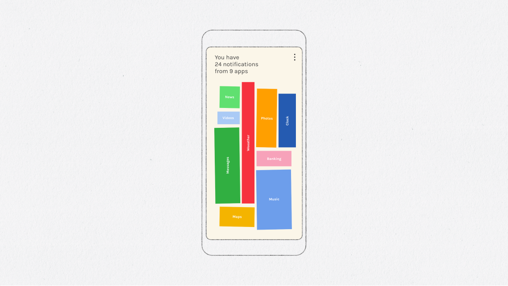
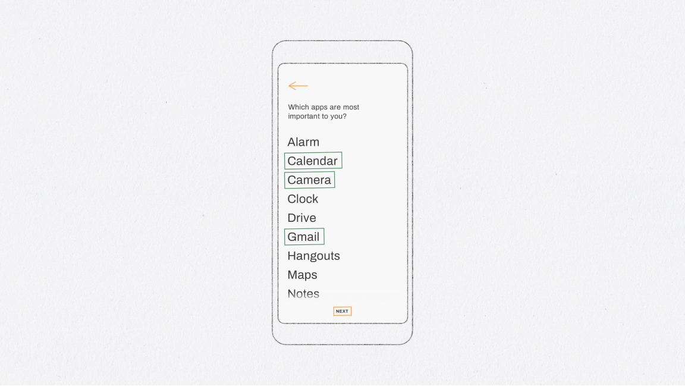
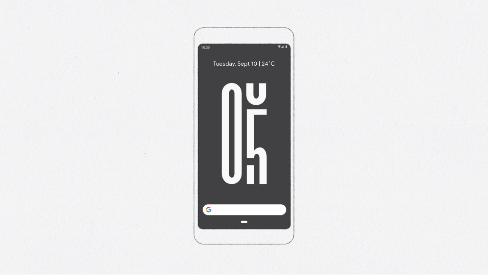
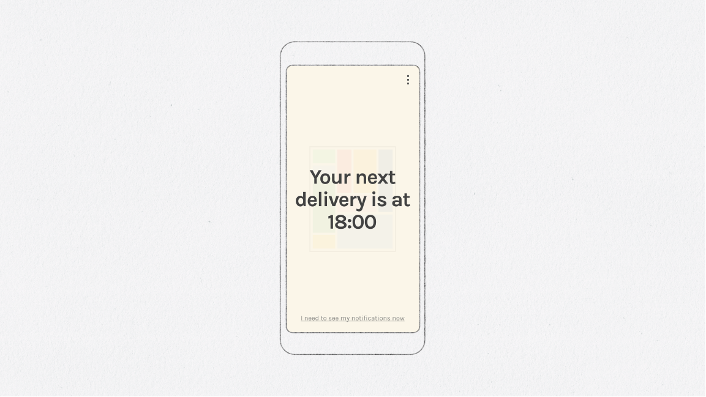

# Digital Wellbeing Experiments toolkit

This repository contains example code for some of the Android features used to create Experiments for the [Digital Wellbeing](https://experiments.withgoogle.com/digitalwellbeing) collection on the [Experiments with Google](https://experiments.withgoogle.com) site. Each directory contains a simple building block that you could use to start creating your own Digital Wellbeing Experiment, or integrate into an existing project.

## About Digital Wellbeing

[The platform](https://experiments.withgoogle.com/digitalwellbeing) is a collection of ideas and tools that help people find a better balance with technology - exploring themes like how we find focus, avoid distractions and spend more quality time with others. We hope to inspire you to make digital wellbeing a key aspect to everything you design and make. Code from the experiments is open source, and we have created helpful guides to get you started. The more people that get involved the more we can all learn about building better technology for everyone. 

## Consider copresence

[We Flip](https://experiments.withgoogle.com/we-flip) is an experiment that encourages its users to switch off from technology as a group. When a group of users open the app together, they can flip an on-screen switch to put all their devices into Do Not Disturb mode. The first person to unlock breaks the session, ending Do Not Disturb for the group. We Flip uses the [Nearby Messages API](https://developers.google.com/nearby/) to detect user copresence.

In the [`copresence/`](copresence/) folder, there is an example project which demonstrates how devices can simply detect one another using the Nearby API, changing the app's display depending on the number of devices connected. 

How could apps use copresence to be more respectful of users spending time together in the real world?

## Build for context

[Morph](https://experiments.withgoogle.com/morph) is an experiment that helps users stay focussed by adapting their phones to what they're doing, by letting them set up different 'Modes' for the different modes of their life. Each Mode is defined as a collection of apps, and a user defined 'trigger', which can be either a time or a place. This experiment used the [Google Maps Places SDK](https://developers.google.com/places/android-sdk/start) and the [Location & GeoFence APIs](https://developer.android.com/training/location/geofencing) to switch its functionality based on the user's context, setting triggers for different states based on a user's location. 

The example code in the [`geolocation/`](geolocation/) directory shows how the state of an app can be updated by a simple geolocation watcher class. In this example, the location simply triggers a change in the app UI, but could be mapped to any aspect of a full-featured application. 

How could changing the functionality of an app based on context help users to focus better on their usage?

## Interacting with notifications

[Post Box](https://experiments.withgoogle.com/post-box) is an experiment that helps users minimise distractions by holding notifications until a time that suits them. To build this experiment, we used the [Notification Listener API](https://developer.android.com/reference/android/service/notification/NotificationListenerService) to gather incoming notifications, store them to a database, and present them to the user later at a time that they have configured. 

There are three example applications in the [`notifications/`](notifications/) directory. 

The first demonstrates how to create a notification listener service which uses notification access permissions to receive all incoming notifications, add them to a database, and present them in a simple list view to the user. 

The second demonstrates how to use the snooze functionality of the Notifications API, which pauses delivery of a notification until a later time. Any notifications received while the app is on screen can be paused for 60 seconds, or allowed to pass through to the OS notification system. This was used in the Morph experiment to pause delivery of notofications from apps outside of a user's current mode.

Finally, a simple notification generator is included for testing your new notification handling experiment.

How could your app use notifications in a way that better respects your user's attention?

## Interacting with apps

[Desert Island](https://experiments.withgoogle.com/desert-island) is an experiment which challenges users to find focus by going a day with only their essential apps. We used the [Package Manager API](https://developer.android.com/reference/android/content/pm/PackageManager) to enumerate the apps installed on the a user's device to present them with a simple, stripped back list of what they have installed on their phones, and keep a track of which apps they open in order to give them feedback on how they use their device.

The example application in [`appInteraction/`](appInteraction/) shows how you can easily get a list of a user's installed apps with application name, package name, and icon. It also includes functionality to detect when a new app is installed, and updates itself accordingly. This feature was also used in the Morph and Post Box experiments, to enable and disable launching apps and filtering system notifications, respectively. 

How could a launcher or app help users focus, or be less distracted when using their device?

## Dynamically surface information

[Unlock Clock](https://experiments.withgoogle.com/unlock-clock) is an experiment that counts and displays the number of times that you unlock your phone in a day, using an [Android Live Wallpaper](https://developer.android.com/reference/android/service/wallpaper/package-summary).

The [`liveWallpaper/`](liveWallpaper/) directory contains the source code for Unlock Clock, which can be modified to display any information to the user. 

How else could a live wallpaper help a user to be more conscious of their tech usage?

## Schedule future actions

Our phones are always-on, always-connected computers, able to update and notify users of new developments and incoming information in real time. However, live data feeds and streaming messages can be both unpredictable and disruptive to users. Using the [Alarm Manager API](https://developer.android.com/training/scheduling/alarms), your app can defer actions until a scheduled point in the future, rather than interrupting a user with notifications.

In [Morph](https://experiments.withgoogle.com/morph), these timers are used to trigger mode changes in the background, with no need for user input; and in [Post Box](https://experiments.withgoogle.com/post-box), they are used to trigger a delivery of notifications at a regular interval.

The [`scheduledActions`](scheduledActions/) directory contains an example project which demonstrates how an app can schedule functionality for future, more appropriate time for the user. 

How could you use scheduled actions to build more respectful and purposeful features for your users?

---

## Notes
This sample code was created by Google Creative Lab for a series of Android experiments in the [Digital Wellbeing](https://experiments.withgoogle.com/digitalwellbeing) collection. __This is not an official Google product.__

We encourage open sourcing projects as a way of learning from each other. Please respect our and other creators’ rights, including copyright and trademark rights when present when sharing these works and creating derivative work. If you want more info on Google's policy, you can find it [here](https://www.google.com/permissions/). To contribute to the project, please refer to the [contributing](CONTRIBUTING.md) document in this repository.
