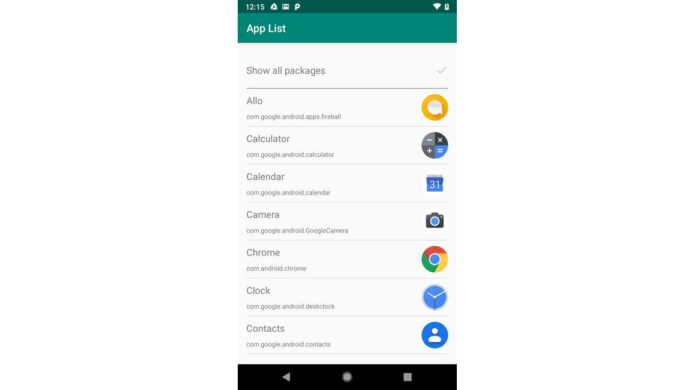

## Interacting with apps

This directory contains an [example project](app-list/) to get started building a Digital Wellbeing experiment which lists the other apps on a device as part of its functionality. This building block project could be used as the starting point for a new experiment, a reference for adding new functionality to another app, or just to learn more about the API.

The example project simply shows a list view containing all of the app names and their icons that have been detected on the device. Using the toggle in the top right corner description you can enable or disable filtering of launchable apps and non-user accessible applications, which you may want to exclude from your app.

In this example, the extensions to PackageManager included in `PackageManagerExtensions.kt` are used to filter the displayed apps by whether they are launchable or not, so as not to flood a user experience (for example, when a launcher) with unlaunchable apps. The list view shows the various useful pieces of information associated with app packages that could be used to build out features and user interface elements.

You can read more about the [Package Manager API](https://developer.android.com/reference/android/content/pm/PackageManager) in the developer documentation.