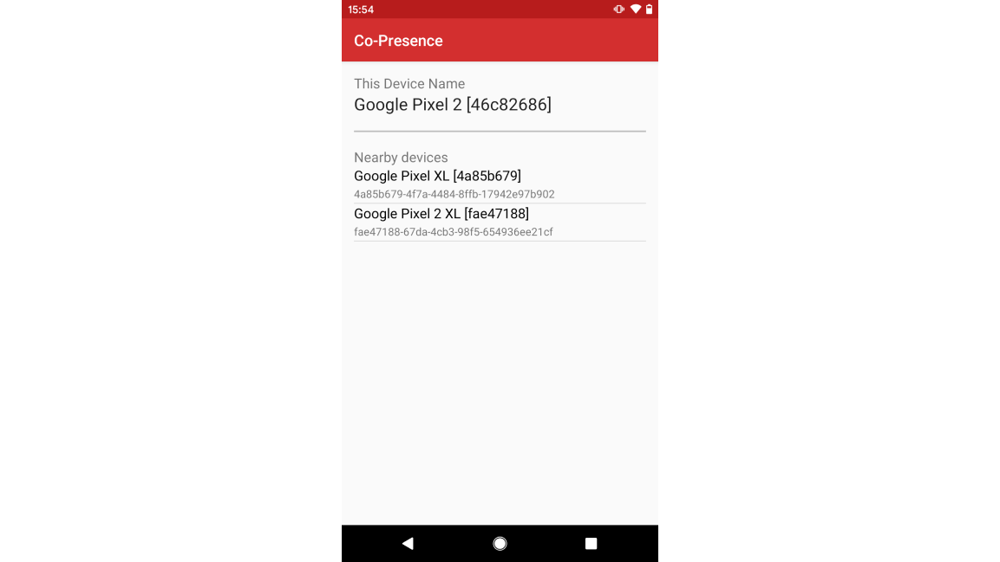

## Consider copresence

This directory contains an example project to get started building a Digital Wellbeing experiment with the Nearby Messages API. This building block project could be used as the starting point for a new experiment, a reference for adding copresence functionality to another app, or just to learn more about the API.

You can learn more about the [Nearby Messages API](https://developers.google.com/nearby/messages/android/get-started) in the developer documentation.

This example uses the nearby messages API to broadcast the presence of a device to any other devices in the vicinity which are also running the app. When the user has granted permission to the API and opened the app, the API will will begin to publish messages.

When another device is detected nearby, a device name will appear on the list, along with an ID. As well as text strings, the nearby messages API can also carry other types of data; for more information see the [developer documentation](https://developers.google.com/nearby/messages/android/get-started). In the [We Flip](https://experiments.withgoogle.com/we-flip) experiment The Nearby Messages API Was used in conjunction with [Firebase](https://firebase.google.com/) to preserve battery life, and persist connections when the screen is locked.