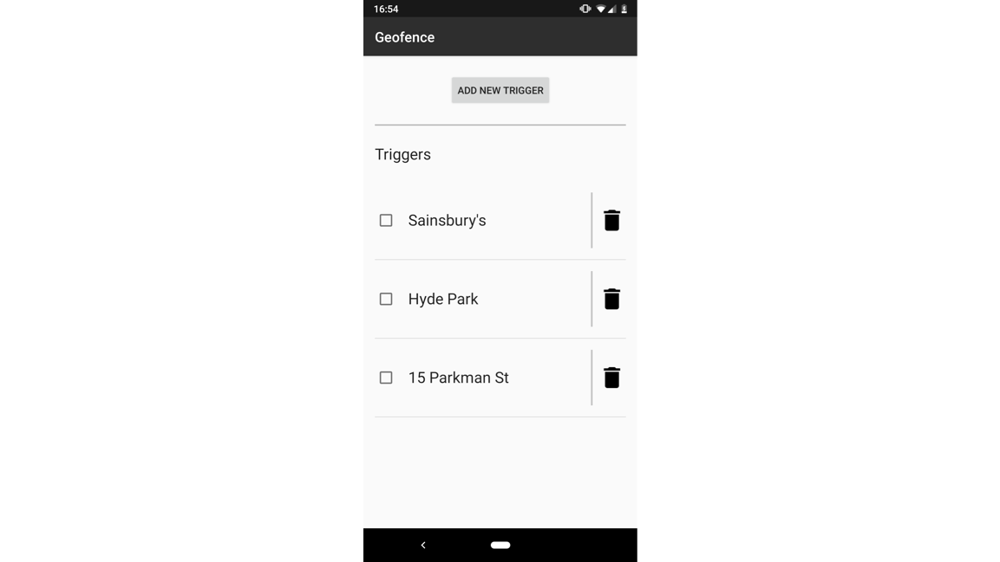

## Build for context

This directory contains an example project to get started building a Digital Wellbeing experiment with geolocation APIs. These building block projects could be used as the starting point for a new experiment, a reference for adding new functionality to another app, or just to learn more about the API.

You can learn more about the [Google Maps Places SDK](https://developers.google.com/places/android-sdk/start) and the [Location & GeoFence APIs](https://developer.android.com/training/location/geofencing) in the developer documentation.

In this example project, a user can enter a location name in the text field to create a geofence, which is added to the main list view. Location names are resolved with the [Google Maps Places SDK](https://developers.google.com/places/android-sdk/start).

Using the [Location & GeoFence APIs](https://developer.android.com/training/location/geofencing) from Google Play Services, the Geofence is scheduled as a [PendingIntent](https://developer.android.com/reference/kotlin/android/app/PendingIntent) object. The app has a [BroadcastReceiver](https://developer.android.com/reference/android/content/BroadcastReceiver) class that the system will call when the device has entered that location. The application will automatically highlight the list element for the triggered geofence.

Note that you may need to leave and re-enter a location to trigger a location change event.

### Running the example code

In order to run the example code, you'll need to create a new API key for the Google Maps API using the [Google Developer Console](https://console.cloud.google.com) and add it to the Android project in the `google_maps_api.xml` file. The package name for this example is `com.digitalwellbeingexperiments.toolkit.geofence`. You will also need to add the SHA-1 certificate fingerprint of your debug key to the cloud project.

There is more information available on the process key creation and app registration in the [Google Maps API Documentation](https://developers.google.com/maps/documentation/android/start#get-key).