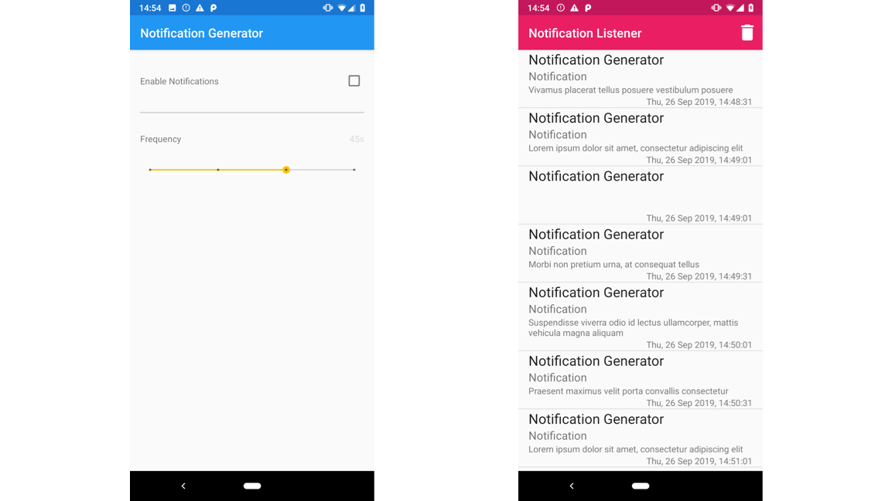

# Interacting with notifications

This directory contains three example projects to get started building a Digital Wellbeing experiment with the Android Notifications API. These building block projects could be used as the starting point for a new experiment, a reference for adding notification handling code to another app, or just to learn more about the API.

You can learn more about the [Android Notifications API](https://developer.android.com/guide/topics/ui/notifiers/notifications) and the [Notification Listener API](https://developer.android.com/reference/android/service/notification/NotificationListenerService) in the developer documentation.

## Example 1: Notification listener
[In this example project](./notifications-listener), the app will create a Notification Listener service and register itself to receive notifications. The service adds all the notifications it receives to a database and presents them in a list view. This example uses the [Notification Listener API](https://developer.android.com/reference/android/service/notification/NotificationListenerService).

## Example 2: Notifications snoozer
[This example](./notification-snoozer) demonstrates the snooze functionality of the Notifications API. With this API the delivery of notifications is deferred until some point in the future. Notifications can be snoozed for any amount of time; when a snooze time has expired the notification will either be sent or it can be snoozed again.

Like the Notification Listener, the app will display a list of current notifications. Each notification in the list shows a snooze button. By tapping this icon, the user can snooze the individual notification for 1 minute. When the notification is snoozed, it disappears from the System UI's Notification Drawer and will be redelivered once the snooze time is over.

This example uses the [Notification Listener API](https://developer.android.com/reference/android/service/notification/NotificationListenerService). Please note that it's not possible to programmatically unsnooze a notification once snoozed, even if the demo app is closed.

## Example 3: Notification generator
[This example](./notification-generator) is a simple notification generator, which can be used for testing your notification handling application. The application runs as a background service, and will continue to send notifications after the foreground window has been closed. You can set the frequency of notifications using the slider, and start and stop the service using the toggle.