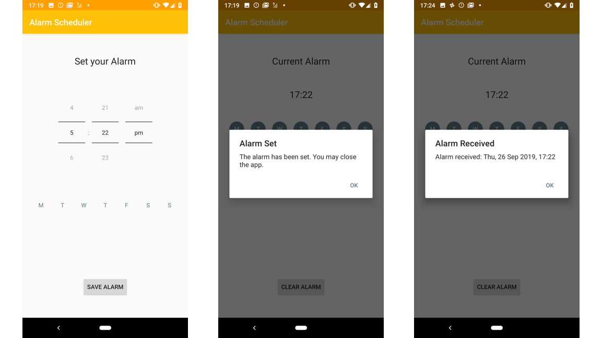

## Schedule future actions

This directory contains an example project to get started building a Digital Wellbeing experiment with the Alarm Manager  API. These building block projects could be used as the starting point for a new experiment, a reference for adding new functionality to another app, or just to learn more about the API.

You can learn more about the [Alarm Manager API](https://developer.android.com/training/scheduling/alarms) in the developer documentation.

The example application in this directory demonstrates how the Alarm Manager API can be used to trigger some functionality of the application at a later time, even when the app has been closed.

Start by selecting a time, and on which days you want to update your app in the background. With an alarm set, you can fully close the app. The alarm is scheduled as a [PendingIntent](https://developer.android.com/reference/kotlin/android/app/PendingIntent) object. The app has a [BroadcastReceiver](https://developer.android.com/reference/android/content/BroadcastReceiver) class that the system will call when the alarm triggers. When you open the app (after the time has been reached), you'll see that the app has been updated in the background. This simple mechanic can be extended to support any functionality in an app that you may wish to apply an timer to, for example assembling a notification report in the [Post Box](https://experiments.withgoogle.com/post-box) experiment, or triggering a mode shift in [Morph](https://experiments.withgoogle.com/morph).